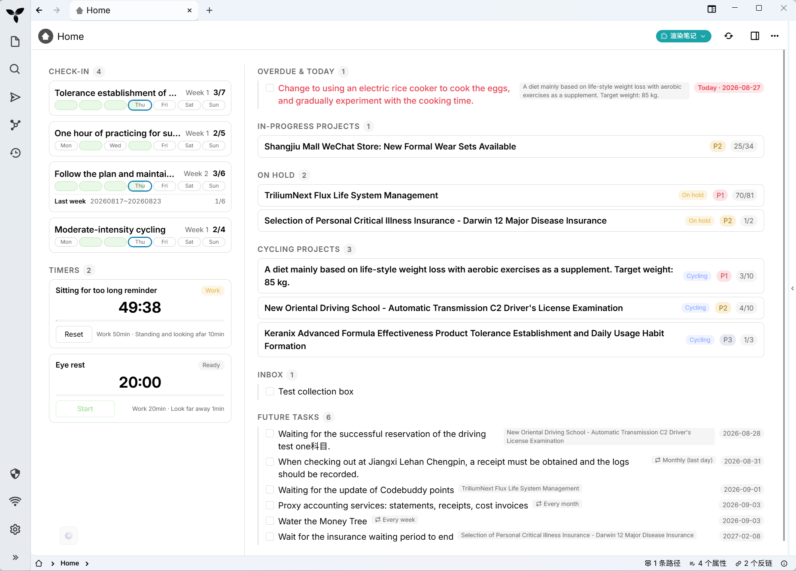
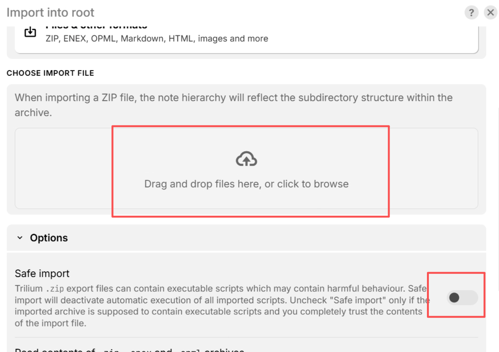
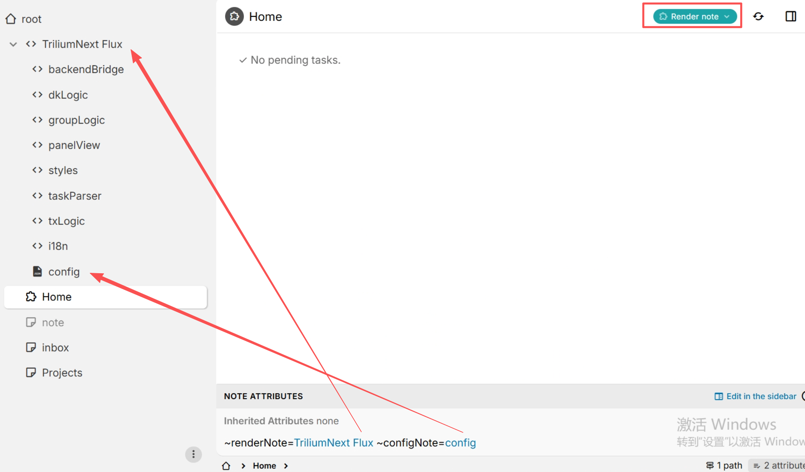
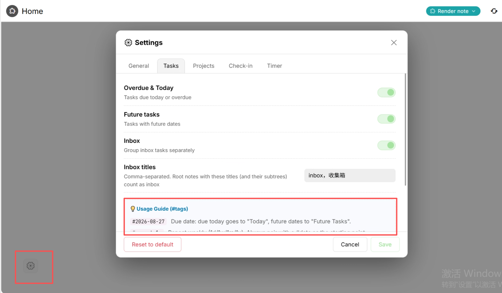

# TriliumNext Flux

> Personal daily project & task manager · TriliumNext plugin

> **[简体中文](./README.zh.md) | English**

## Overview

Turn "achieving goals through projects" into a task panel you can see and complete every day, right inside your Trilium notes.

TriliumNext Flux is a Render plugin that runs in [TriliumNext](https://github.com/TriliumNext/Trilium). It organizes your daily tasks around **projects**:

- **Project-driven**: In-progress / on-hold / cycling-phase projects are grouped and displayed with progress at a glance
- **Today first**: Overdue & today, future tasks and inbox are automatically categorized — open the panel and know what to do today
- **Habit support**: Weekly check-ins and interval timer reminders keep you on your execution rhythm

**Features**

| | |
|---|---|
| Data ownership | Everything is stored in Trilium notes — no external storage, no third-party services |
| Zero dependencies | Pure frontend implementation, no third-party libraries |
| Bilingual | One-click language switch (Chinese / English) |
| Flexible config | Each feature can be toggled; fixed tags with built-in # quick insert |
| Lightweight | Auto-refresh every 30 seconds without extra overhead |

## Preview



> In the screenshot: check-in and interval timer reminder cards on the left; task and project groups on the right.

## Installation

### Prerequisites

- **TriliumNext** installed (version 0.105.0 or above; older versions may also work but have not been tested)
- Download the latest plugin zip from the [Releases page](https://github.com/ZangXincz/TriliumNext-Flux/releases)

### Import steps

1. If backend script execution has not been enabled before, enable it under `Settings` → `Security`

2. **Import the plugin zip**: right-click the Trilium root directory → Import into note → select the zip file → uncheck "Safe import"
   

   After import
   

3. Create a Home note with type `Render`, set attributes `~renderNote=TriliumNext Flux` and `~configNote=config`, save and press F5 to refresh
   

That's it — the basic setup is done. You can tweak the basics and view the usage guide in the settings afterwards


## Usage

The plugin automatically collects checkbox tasks from your notes and displays them in groups. All tags are `#markers` written in the task text. Each one is explained below.

### Panel overview

The panel is divided into several groups from top to bottom (each can be toggled in settings):

| Group | Content |
|---|---|
| Overdue & Today | Tasks due today or already overdue |
| In-Progress Projects | Project cards with `state=In-Progress` |
| On Hold / Awaiting Response | Project cards with `state=On-Hold` |
| Cycling-Phase Projects | Project cards with `state=Cycling-Phase` |
| Inbox | Tasks inside inbox notes and their subtrees |
| Future Tasks | Tasks marked with a future date |
| Check-in | Check-in cards with `#habit` tags |
| Interval Timer Reminder | Timer cards with `#timer` tags |

The panel auto-refreshes every 30 seconds; you can also trigger a manual refresh.

### Tasks

#### Basic syntax

Just write a regular task list (Trilium todo list) in any text note — the plugin picks it up automatically:

```markdown
- [ ] Write weekly report
- [ ] Reply to John's email
- [ ] Book a physical exam
```

The panel aggregates all these tasks. Click the **✓** at the start of a row to complete it (written to the backend, checkbox grayed out and faded).

#### Assigning a date

Add a date to the task text and the plugin categorizes it by due time automatically:

```markdown
- [ ] Submit quarterly reimbursement #2026-08-28
- [ ] Organize travel photos #2026-09-05
```

- Date is **today** → shows under "Overdue & Today" (marked "Today")
- Date is **past** → shows under "Overdue & Today" (marked "Overdue")
- Date is **future** → shows under "Future Tasks"

#### Opening the note

Click the **↗** on the right of a task row to open the note it belongs to, jumping straight to the corresponding checkbox.

### Repeating tasks

Use the `#repeat` tag to advance a task on a fixed cycle — great for daily / weekly / monthly / yearly recurring tasks:

```markdown
- [ ] Morning review #2026-08-27 #repeat:1d
- [ ] Update project weekly report #2026-08-31 #repeat:1w
- [ ] Credit card payment #2026-08-25 #repeat:1m
- [ ] Annual physical #2026-08-27 #repeat:1y
```

Syntax: `#repeat:<interval><unit>`, where interval is a positive integer and unit is `d` (days) / `w` (weeks) / `m` (months) / `y` (years). The tag is fixed to `#repeat` (no customization).

**Rules**:

- Advance by schedule: on completion, the current scheduled date is written to history, the `#date` on the task auto-advances to the next occurrence, and the checkbox resets to unchecked — no manual date editing.
- Position-based: suffix `:start` (month start) / `:end` (month end) / `:endwork` (last workday of the month) allows **omitting `#date`** — the plugin computes and writes the scheduled date for the current period automatically.
- Advance by actual completion: suffix `:actual` computes the next occurrence from the **day you actually completed it** — after a missed streak, completing late does not backfill the missed dates; it simply rolls forward from the real completion day.

```markdown
- [ ] Pay rent #repeat:1m:start        # 1st of every month
- [ ] Month-end review #repeat:1m:endwork    # last workday of every month
- [ ] Vocabulary #2026-08-27 #repeat:1d:actual   # rolls forward from actual completion day after a break
```

Each completion auto-creates a **history sub-task** below the task (checked, with the completion date). When history exceeds 4 entries, it collapses to "…completed N times in between…", keeping only the earliest 2 and latest 2 entries — counting is unaffected.

### Projects

Add a `state` attribute to any note and it becomes a project card:

| Attribute value | Displayed as |
|---|---|
| `state=In-Progress` | In-Progress Projects |
| `state=On-Hold` | On Hold / Awaiting Response |
| `state=Cycling-Phase` | Cycling-Phase Projects |

Sort project cards with the `#priority` tag (P1 highest, then P2, P3; cards without it go last):

```markdown
state=In-Progress
#priority=P1

- [ ] Finish homepage design
- [ ] Integrate login API
```

Each card shows the project's checkbox progress `done/total`. Click a card to open the project note.

> Scope note: by default all notes with the `state` attribute are scanned; if you configure "Project root" in settings, only project cards inside those folders (including subtrees) are counted.

### Inbox

Great for jotting down ideas and loose to-dos that you haven't decided where to put yet, and organizing them later. No date or project needed:

```markdown
- [ ] Idea for a book club, tidy up later
- [ ] Bring a coffee for a colleague
```

**How it's detected**: notes whose titles match the "Inbox titles" (default `inbox` / `收集箱`, customizable in settings, comma-separated) and their **entire subtrees** are treated as inbox — this works at any level of the tree.

**Behavior**:

- Inbox tasks are shown **as their own group** (the panel's "Inbox" group) and do not mix into "Overdue & Today" / "Future Tasks".
- Completing, opening notes, etc. work the same as regular tasks.
- If you **turn off the "Inbox" toggle** in settings, inbox tasks are no longer grouped separately — they **fall back to the regular groups by date**: tasks with `#date` show in "Overdue & Today" or "Future Tasks" as usual, and undated ones appear in the corresponding place too.

### Weekly check-in

For long-term habits like "complete N days per week". Write it in the task text:

```markdown
- [ ] Early rising #habit:5
- [ ] Running #habit:4:2
```

Syntax: `#habit:<weekly target days>`, optionally `:<max times per day>`.

- `#habit:5`: weekly target of **5 days**, at most **1 check-in per day**.
- `#habit:4:2`: weekly target of **4 days**, at most **2 per day**. Filling 2 times in one day counts as completing that day; weekly progress is counted in **days** (not times).
- The tag is fixed to `#habit` (no customization).

**How to use**:

- The check-in card shows 7 cells for "this week, Monday–Sunday". Click any cell to check in.
- Day count not full → click to +1; full → click again to reset (cancel that day's check-in).
- Records are auto-written to a sub-list below the task. The text follows the UI language — Chinese-only day names in Chinese, English-only in English:
  - Chinese UI: `20260824~20260830 dk1周：周一(1/2)，周二(2/2)（周进度4/6）`
  - English UI: `20260824~20260830 dk1w(Week 1): Mon(1/2), Tue(2/2) (Weekly 4/6)`
- History is collapsed by week (Monday–Sunday range), most recent week first; this week's progress shows `completed days/target days` in real time.

### Interval timer reminder

For Pomodoro and work/rest rhythm management. Write it in the task text:

```markdown
- [ ] Deep work #timer:50:10
- [ ] Thesis writing #timer:25:5:Focus:Break
- [ ] Meditation #timer:30
```

Syntax: `#timer:<work minutes>:<rest minutes>:<work phase name>:<rest phase name>` — the last two custom phase names are optional.

- `#timer:50:10`: 50 minutes of work, 10 minutes of rest.
- `#timer:25:5:Focus:Break`: phases shown as "Focus" and "Break".
- `#timer:30`: only the work duration is given; the rest minutes use the default from settings (5 minutes by default).

**How to use**:

- Click "Start" to enter the work phase. When the countdown finishes it automatically enters "Ready to rest" and reminds you in the configured ways (message popup / fullscreen / sound — selectable in settings, multiple allowed).
- Click "Start rest" to enter the rest phase; when rest ends you are reminded again and can start over.
- Click "Reset" to return to the idle state anytime.
- Timer state is auto-persisted to the config note — **the countdown resumes after refreshing the page**, nothing is lost.

The tag is fixed to `#timer` (no customization).

### Quick insert (#)

Type `#` in task text and a candidate menu pops up for fast tag completion — dates, repeat, check-in, timer (can be disabled in settings):

- Type `#` → common candidates: today / tomorrow / more dates (type `next` to expand) / `#repeat` / `#habit` / `#timer`
- Keep typing to filter in real time, e.g. `#repeat:2w`, `#habit:3`, `#timer:50`
- `↑` `↓` to select, `Enter` or `Tab` to insert, or click directly
- Can be turned off under Settings → General

### Settings

Click the **⚙️ Settings** gear in the top-right corner of the panel. There are 5 tabs, and each tab includes the corresponding `#tag` usage guide at the bottom:

| Tab | Options |
|---|---|
| General | Language (中文 / English), enable/disable plugin, quick insert (#) toggle, version info, GitHub repo |
| Tasks | Toggles: Overdue & Today / Future Tasks / Inbox; inbox titles (comma-separated) |
| Projects | Toggles: In-Progress Projects / On Hold & Awaiting Response / Cycling-Phase Projects; project root (comma-separated, empty = scan all notes) |
| Check-in | Check-in feature toggle (tag fixed to `#habit`) |
| Reminder | Reminder feature toggle; default rest minutes; notification methods (message / fullscreen / sound, multiple) |

**Before saving**: settings are written to the config note pointed to by the `~configNote` relation on the host note (`json` or `code` type). Before saving for the first time, make sure the relation has been added as described in "Installation" — otherwise you'll get a "Config note not found" warning.

- **Save**: only updates the changed fields; other fields you added manually to the config note are preserved.
- **Reset to default**: writes back the entire default config (with a confirmation prompt).

### Data sources and scan scope

| Data type | Scan scope |
|---|---|
| Tasks / Check-in / Reminder | All text notes in the tree (parsed by `#tags`) |
| Inbox | Notes whose titles match the "Inbox titles" and their entire subtrees (any level) |
| Project cards | With "Project root" configured → only notes with `state` inside those folders (incl. subtrees); otherwise → all notes with `state` in the whole tree |

### FAQ

**Q1: The panel warns "Config note not found" — what should I do?**
Add the relation `configNote` on the host note, pointing to a `json` or `code` type note, then save and press F5. Without a config note the plugin runs on the built-in defaults, but settings cannot be saved.

**Q2: Clicking a task checkbox does nothing?**
Make sure backend script execution is enabled (Settings → Security) and the plugin runs as a Render note (via the `~renderNote` relation).

**Q3: My timer is gone after refreshing?**
Timer state is stored in the `txState` field of the config note; without a config note it cannot be persisted (the timer still runs, it just resets on refresh).

**Q4: What do the numbers on the check-in cells mean?**
With `#habit:4:2`, at most 2 per day. `1/2` on a cell means 1 of today's 2 check-ins done; once full the cell shows as completed and clicking again resets it.

**Q5: Why do repeating tasks gain extra history sub-tasks?**
Those are completion records (with completion dates) auto-written by the plugin. Regular tasks without a repeat tag don't generate history — they're simply marked complete.

## License

This project is open-sourced under the [MIT License](./LICENSE). You are free to use, modify and distribute it, provided you retain the copyright notice. See [LICENSE](./LICENSE) for details.
