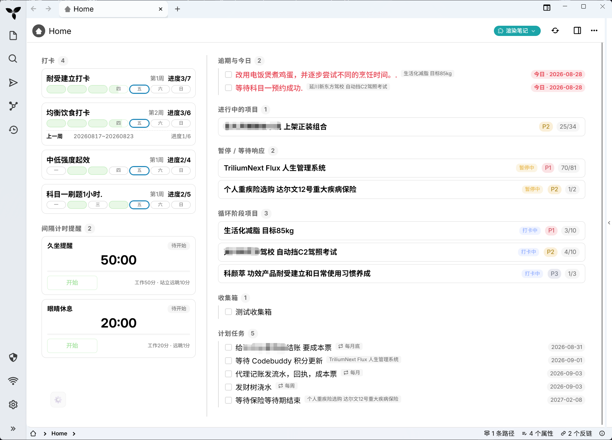
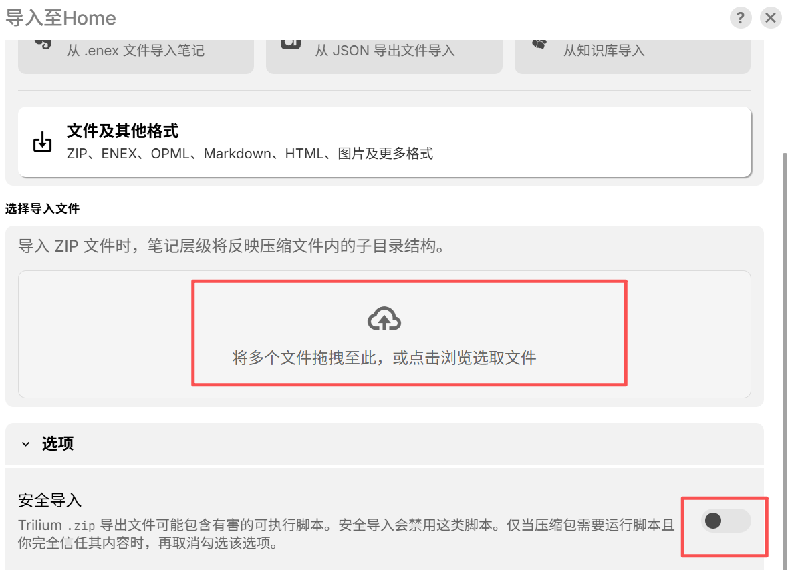
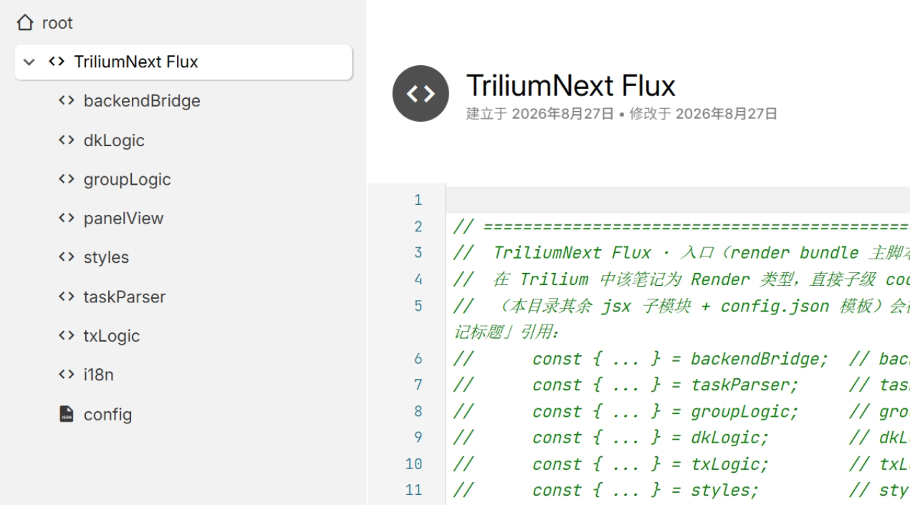
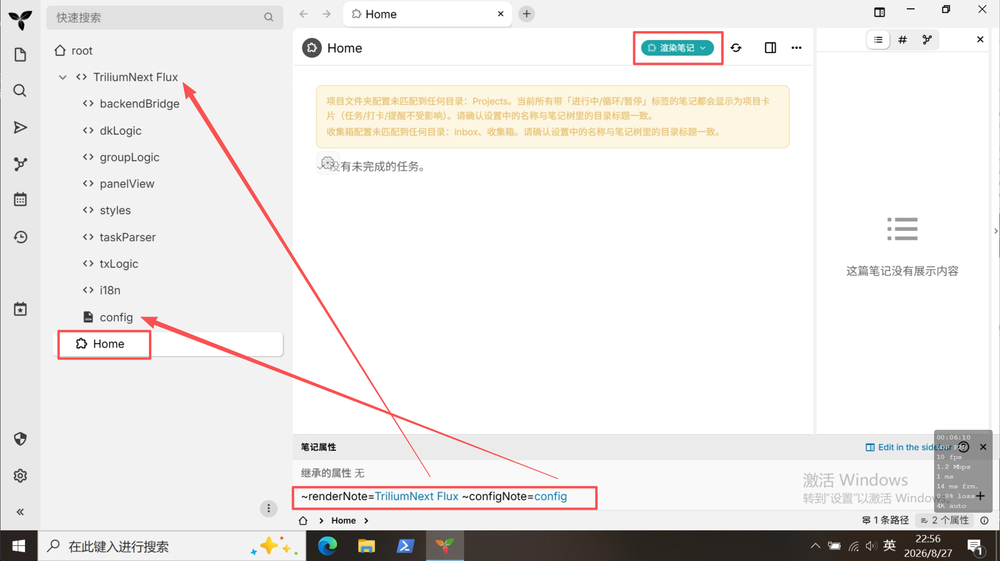
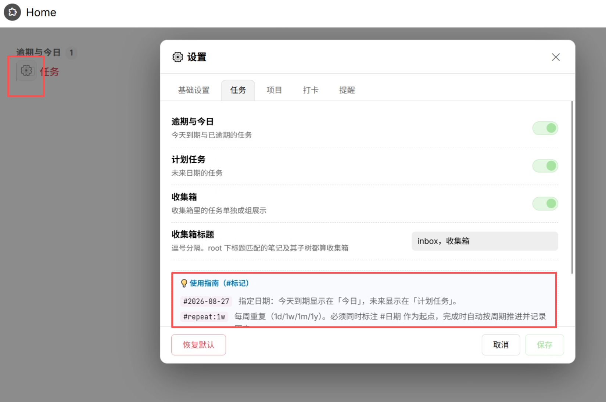

# TriliumNext Flux

> 个人日常项目任务管理 · TriliumNext 插件

> **简体中文 | [English](./README.md)**

## 项目简介

把「以项目达成目标」这件事，在 Trilium 笔记里变成每天看得见、做得完的任务面板。

TriliumNext Flux 是一个运行在 [TriliumNext](https://github.com/TriliumNext/Trilium) 中的 Render 插件，以**项目**为核心组织你的日常任务：

- **项目驱动**：进行中 / 暂停 / 循环阶段项目分组展示，进度一目了然
- **当天优先**：逾期与今日、计划任务、收集箱自动归类，打开面板就知道今天该做什么
- **辅助习惯**：周打卡与间隔计时提醒，帮你保持执行节奏

**特点**

| | |
|---|---|
| 数据自主 | 全部保存在 Trilium 笔记内，无外部存储、无第三方服务 |
| 无依赖 | 纯前端实现，零第三方库 |
| 中英双语 | 界面语言一键切换 |
| 灵活配置 | 各功能可开关，标签固定，内置 # 快速录入 |
| 固定排序 | `#priority` 标签固定任务 / 打卡 / 提醒顺序（1-10） |
| 轻量 | 30 秒自动刷新，不引入额外负担 |

## 界面预览

## 安装方法

### 前提

- 已安装 **TriliumNext**（0.105.0版及以上，低于此版本可能也支持，只是我没有测试过）
- 从 [Releases 下载页](https://github.com/ZangXincz/TriliumNext-Flux/releases) 下载最新插件 zip 包

### 导入步骤

1. 如之前未开启过`后端脚本执行`，需要在`设置`->`安全` 中开启

2. **导入插件压缩包**：在 Trilium root目录，鼠标右键，导入到笔记，选择zip包，取消勾选安全导入
   

   导入图示
   

3. 创建一个Home页，笔记类型为`渲染笔记`，设置属性`~renderNote=TriliumNext Flux` 和`~configNote=config`，保存后F5刷新
   

这样就基本配置完成了，后续可以在设置进行基础修改和查看基本使用说明

## 使用方法

插件面板把笔记里带复选框（checkbox）的任务自动抓取并分组展示。所有标签都是写在任务文本里的 `#标记`。

### 面板总览

| 分组 | 内容 |
|---|---|
| 逾期与今日 | 今天到期与已逾期的任务 |
| 进行中的项目 | `state=In-Progress` 的项目卡片 |
| 暂停 / 等待响应 | `state=On-Hold` 的项目卡片 |
| 循环阶段项目 | `state=Cycling-Phase` 的项目卡片 |
| 收集箱 | 收集箱笔记及其子树里的任务 |
| 计划任务 | 标注了未来日期的任务 |
| 打卡 | 带 `#habit` 标签的打卡卡片 |
| 间隔计时提醒 | 带 `#timer` 标签的计时卡片 |

### 标签速查表

| 标签 | 作用 | 示例 |
|---|---|---|
| `#2026-08-28` | 到期日期：今天/逾期 →「逾期与今日」，未来 →「计划任务」 | `- [ ] 提交报销 #2026-08-28` |
| `#repeat:1w` | 重复任务：`d`/`w`/`m`/`y` 固定周期，可加 `:start` / `:end` / `:endwork` / `:actual` | `- [ ] 周报 #repeat:1w` |
| `#habit:5` | 周打卡：每周目标 N 天，可选 `:M` 每天最多 M 次 | `- [ ] 早起 #habit:5` |
| `#timer:50:10` | 间隔计时：进行/休息分钟，可加自定义阶段名 | `- [ ] 深度工作 #timer:50:10` |
| `#priority:1` | 固定排序：1-10 越小越靠前（日期优先，同日期内排序） | `- [ ] 复盘 #2026-08-28 #priority:1` |
| `state=In-Progress` | 笔记属性 → 项目卡片（另有 `On-Hold` / `Cycling-Phase`） | `state=In-Progress` |
| `#priority=P1` | 笔记属性 → 项目排序（P1 最高） | `#priority=P1` |

> **收集箱** 按笔记标题识别（默认 `inbox` / `收集箱`），不是标签——其整棵子树内的任务组成「收集箱」分组。
>
> 每个标签的完整规则与进阶用法见 **设置 → 各页签底部的使用指南**；任务文本里输入 `#` 也会弹出实时候选提示。

### 快速录入（#）

任务文本中输入 `#` 即可快速补全标签：`↑` `↓` 选择，`Enter` 或 `Tab` 插入，或直接点击。可在设置 → 基础设置中关闭。

### 设置

点击面板左下角的 **⚙️ 设置** 打开设置弹窗，共 5 个 Tab，每个 Tab 底部都附有对应的 `#标记` 使用指南：

| Tab | 配置项 |
|---|---|
| 基础设置 | 语言（中文 / English）、是否启用插件、# 快速录入开关、版本信息、GitHub 仓库 |
| 任务 | 开关：逾期与今日 / 计划任务 / 收集箱；收集箱标题（逗号分隔） |
| 项目 | 开关：进行中的项目 / 暂停与等待响应 / 循环阶段项目；项目上级目录（逗号分隔，留空扫全树） |
| 打卡 | 打卡功能开关（标签固定为 `#habit`） |
| 提醒 | 提醒功能开关；默认休息分钟；提醒方式（弹窗 / 全屏 / 声音，可多选） |

设置写入 `~configNote` 关系指向的配置笔记（`json` 或 `code` 类型）。**保存**仅更新改动字段；**恢复默认**将整份默认配置写回（有确认提示）。

### 常见问题

**Q1：面板提示「未找到配置笔记」怎么办？**
在宿主笔记上添加关系 `configNote`，指向一个 `json` 或 `code` 类型的配置笔记，保存后 F5 刷新。没有配置笔记时插件用内置默认配置运行，但无法保存设置。

**Q2：勾选任务没有反应？**
确认后端脚本执行已开启（设置 → 安全），且插件以 Render 笔记形式运行（`~renderNote` 关系）。

**Q3：计时状态刷新后不见了？**
计时状态保存在配置笔记的 `txState` 字段中；若没有配置笔记则无法持久化。

**Q4：打卡格子上的次数是什么意思？**
`#habit:4:2` 中每天最多 2 次。格子上 `1/2` 表示今天已打 1 次、共 2 次；打满后再次点击清零。

**Q5：为什么重复任务会多出历史子任务？**
那是插件自动写入的完成记录（含完成日期）。没有重复标签的普通任务勾选后不会生成历史。

## 开源协议

本项目基于 [MIT License](./LICENSE) 开源。你可以自由使用、修改与分发，但需保留版权声明。
